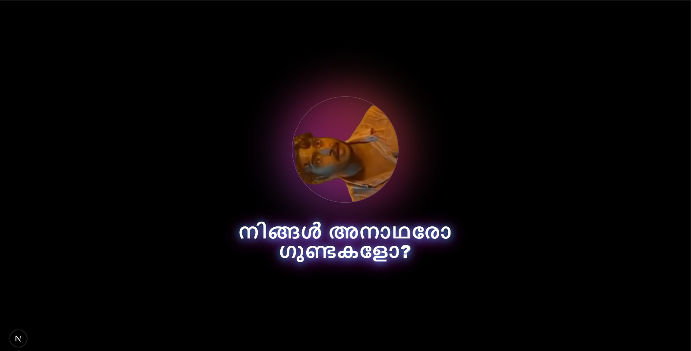
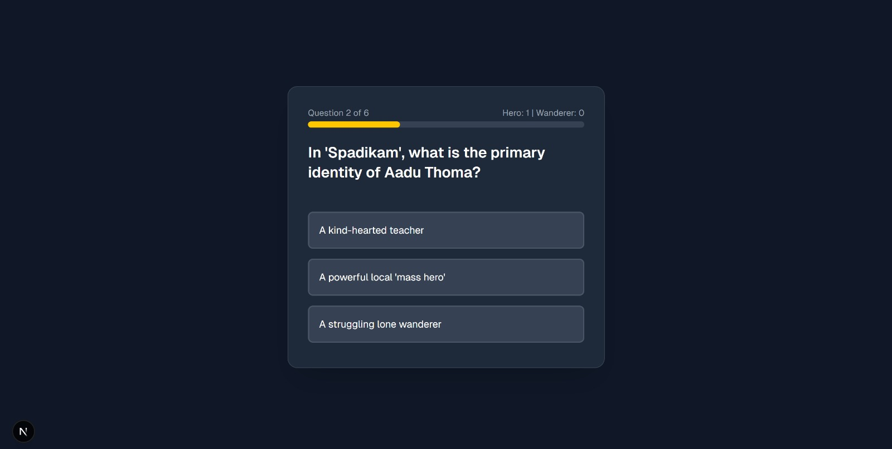
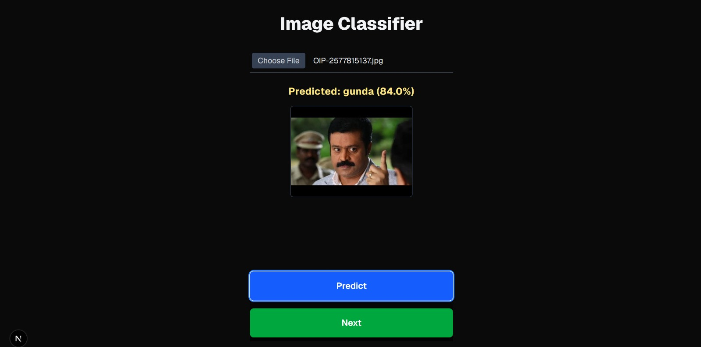

# [അനാഥനാണോ ഗുണ്ടയാണോ ] 🎯

## Basic Details
### Team Name: [McAfee]

### Team Members
* Member 1: [Fathimath Dhaliya Noushad VP] - [SOE,CUSAT]
* Member 2: [Fathima Rasha Abdul Rahim] - [SOE,CUSAT]

### Hosted Project Link

[അനാഥനാണോ ഗുണ്ടയാണോ]([https://jsk-1x8j.onrender.com/](https://jsk-1x8j.onrender.com/))

### Project Description
[A completely useless Malayalam meme–inspired web app that uncovers your true identity through a totally scientific 3-level process: a quiz, a chaotic mini-game, and an actual trained image classification model to decide if you’re a gunda or an orphan.]

### The Problem (that doesn't exist)
[കേരളത്തിന്റെ മക്കൾ അനാഥരോ ഗുണ്ടകളോ ?]

### The Solution (that nobody asked for)
[അനാഥനാണോ ഗുണ്ടയാണോ എന്നുള്ള തിരിച്ചറിവ് ]

## Technical Details
### Technologies/Components Used
For Software:
* [Python,JavaScript]
* [Next.js]
* [TensorFlow,NumPy,Tailwind,React]
* [VS Code,Google Colab,Jupyter Notebook,Render]

For Hardware:
* [No hardware components are required]

### Implementation
For Software:
# Installation
[git clone https://github.com/Dhaliyanoushad/jsk.git]
[npm i]

# Run
[npm run dev]

### Project Documentation
For Software:

# Screenshots (Add at least 3)

*The above image shows the preloader of our webapp*

*The image shows our quiz where based on the answers the user gave, the gunda or orphan scale updates  *

*Here the user photo is uploaded and the trained model detects if the user is a gunda or an orphan*

### Project Demo
# Video
[[Add your demo video link here](https://drive.google.com/file/d/1ABaajBQ3SXHwLFuhxwkPuiS9zdx9JI9G/view?usp=sharing)]
*This video demonstrates the key features and functionalities of the project, including brief description of what the video showcases.*

## Team Contributions
* [Fathimath Dhaliya Noushad V P]: [Trained Model in Tensorflow.js to classify images, created quiz]
* [Fathimna Rasha]: [Created the game , Loader page]
---
Made with ❤️ at TinkerHub Useless Projects 

